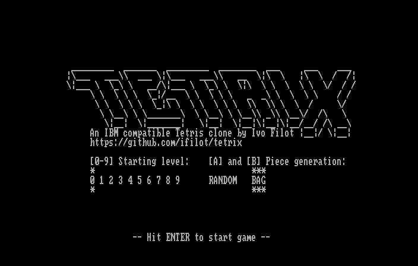
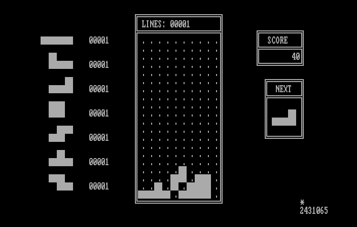

# Tetrix

[](https://github.com/ifilot/tetrix/releases/)
[](https://github.com/ifilot/tetrix/actions/workflows/build.yml)
[](https://www.gnu.org/licenses/gpl-3.0)

## Purpose

Tetris clone for an IBM compatible using only MDA graphics (text mode). The game
is specically programmed in 8086/8088 assembly and does not use e.g. any 80286
or higher instructions.





## Downloads

Download the executable (`.COM`) file and/or 360KiB floppy image (`.IMG`).

* [TETRIX.COM](https://github.com/ifilot/tetrix/releases/latest/download/TETRIX.COM)
* [TETRIX.IMG](https://github.com/ifilot/tetrix/releases/latest/download/TETRIX.IMG)

## Features

Currently, the following features are [x] implemented or [ ] planned.

* [x] Selection whether pieces are generated randomly or using a 
      [bag-of-seven](https://tetris.fandom.com/wiki/Random_Generator) procedure.
* [ ] Select starting level (changes movement speed)
* [x] Upon rotation, the pieces are allowed to perform 
      [wall kicks](https://tetris.fandom.com/wiki/Wall_kick) using the
      [SRS system](https://harddrop.com/wiki/SRS).

## Keymap

*Tetrix* uses the `ASDF` or the `UP/DOWN/LEFT/RIGHT` keys to move the pieces.

* `S/DOWN` will move the piece downwards
* `A/LEFT` will move the piece to the left
* `D/RIGHT` will move the piece to the right
* `W/UP` will rotate the piece in the clockwise direction. Currently, no
   counterclockwise rotation is implemented.

## Compilation

To compile *Tetrix*, you need to install the [NASM](https://www.nasm.us/)
assembler.

```bash
sudo apt install -y nasm
```

Go to the `src` folder and run

```bash
make
```

## Emulation

### DOSBox

Tetrix can be run on a modern computer using emulation.
[DOSBox](https://www.dosbox.com/) is the recommended application for running
Tetrix. To run *Tetrix* in DOSBox, go to the `src` folder and run

```bash
make rundosbox
```

### DOSBox-X

Although *Tetrix* runs perfectly in DOSBox, DOSBox does not support emulation of
the 8086/8088 CPU and will happily execute instructions which are only valid for
80386 or higher CPUs. As such, for a somewhat more accurate emulation, one can
use [DOSBox-X](https://dosbox-x.com/). A configuration file is provided in the
`src` folder to automatically configure DOSBox-X to emulate an 8086 CPU with the
appropriate number of cycles. Note that to the best understanding of this
author, DOSBox-X is in constrast to DOSBox not yet shipped with standard package
managers and one has to compile and install the emulator on their machine.
Detailed instructions are provided on the [build
page](https://github.com/joncampbell123/dosbox-x/blob/master/BUILD.md) and the
procedure is fairly simple. Once compiled **and** installed, *Tetrix* can be
launched in the DOSBox-X emulator using the following instruction.

```bash
make rundosbox-x
```

## Deployment

For deployment to actual hardware and to e.g. a [browser-based IBM 5150
emulator](https://www.pcjs.org/machines/pcx86/ibm/5150/mda/), it is convenient
to have a disk version of Tetrix available. To generate a 360KiB floppy disk
image for *Tetrix*, run in the `src` folder:

```bash
./makeimg.sh
```

## Useful resources

* [List of interrupts](https://stanislavs.org/helppc/idx_interrupt.html)